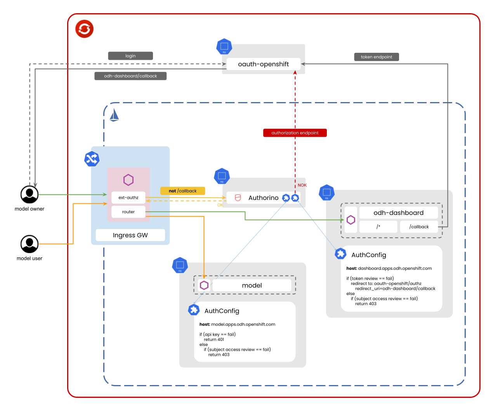

# Open Data Hub protected with Authorino Ext-Authz

This is a Proof of Concept of protecting [Open Data Hub](https://opendatahub.io/) with [Authorino](https://github.com/kuadrant/authorino) external authorization on an OpenShift cluster.

## Target architecture



## Try

### Requirements

- OpenShift cluster with the following operators installed:
  - OpenShift Service Mesh (OSSM)
  - Authorino
- CLI tools
  - `kubectl`
  - `oc`
  - `jq`

### Setup

<details>
  <summary>① Clone the repo</summary>

  ```sh
  git clone git@github.com:bartoszmajsak/odh-authorino.git && cd odh-authorino
  ```
</details>

<details>
  <summary>② Store the OpenShift cluster domain in the shell</summary>

  <br/>

  > ⚠️ This step is important as well for other parts of the tutorial further below. Do not skip it.

  ```sh
  export CLUSTER_DOMAIN=gui-rhods.2hfs.s1.devshift.org
  ```
</details>

<details>
  <summary>③ Login to the cluster</summary>

  ```sh
  oc login --token=... --server=https://api.$CLUSTER_DOMAIN:6443
  ```
</details>

<details>
  <summary>④ Configure the service mesh control plane</summary>

  ```sh
  make smcp | kubectl apply -f -
  sleep 4 # to prevent kubectl wait from failing
  kubectl wait --for condition=Ready smcp/basic --timeout 300s -n istio-system
  ```
</details>

<details>
  <summary>⑤ Deploy Authorino</summary>

  ```sh
  make authorino | kubectl apply -f -
  ```

</details>

### Try with a sample application first

<details>
  <summary>① Deploy the sample application (Talker API)</summary>

  <br/>

  ```sh
  make talker-api | kubectl apply -f -
  ```
</details>

<details>
  <summary>② Test endpoints of the Talker API protected behind Authorino</summary>

  <br/>

  Try the API without an access token:

  ```sh
  curl https://talker-api.apps.$CLUSTER_DOMAIN -I --insecure
  # HTTP/2 401 
  # www-authenticate: Bearer realm="kubernetes-users"
  # x-ext-auth-reason: Access denied
  ```

  Try the API as the same user logged in to OpenShift cluster in the terminal:

  ```sh
  curl -H "Authorization: Bearer $(oc whoami -t)" https://talker-api.apps.$CLUSTER_DOMAIN -I --insecure
  # HTTP/2 200 
  # content-type: application/json
  # server: istio-envoy
  # ..
  ```

  _(Optional)_ Inspect the token:

  ```sh
  kubectl create -o json -f -<<EOF
  apiVersion: authentication.k8s.io/v1
  kind: TokenReview
  spec:
    token: $(oc whoami -t)
  EOF
  ```
  
</details>

### Cleanup

```sh
make authorino | kubectl delete -f -
make talker-api | kubectl delete -f -
make smcp | kubectl delete -f -
```
